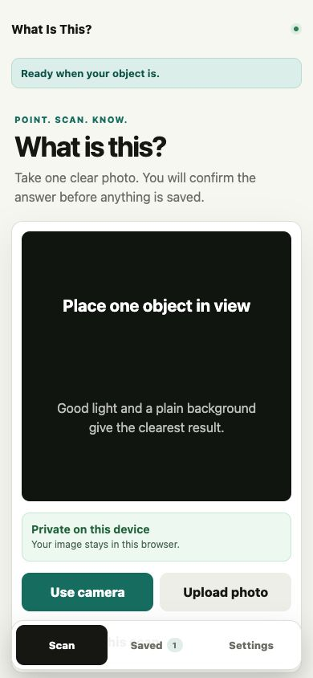
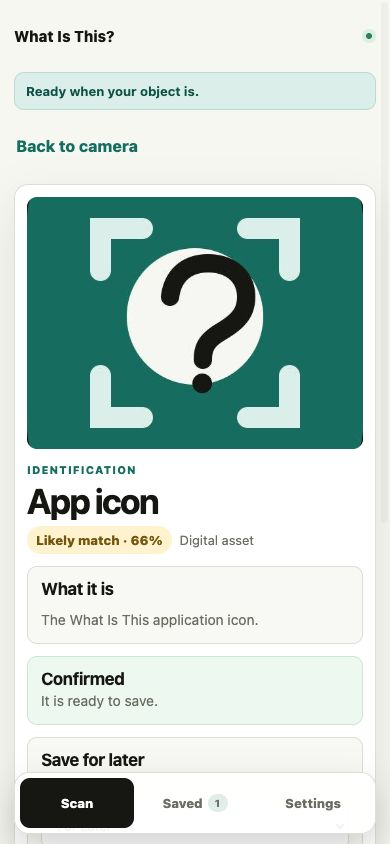
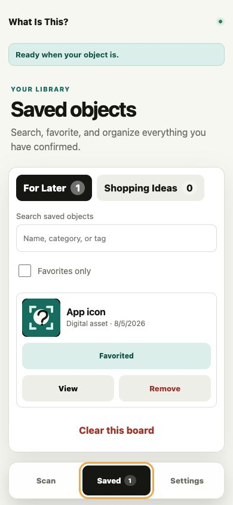
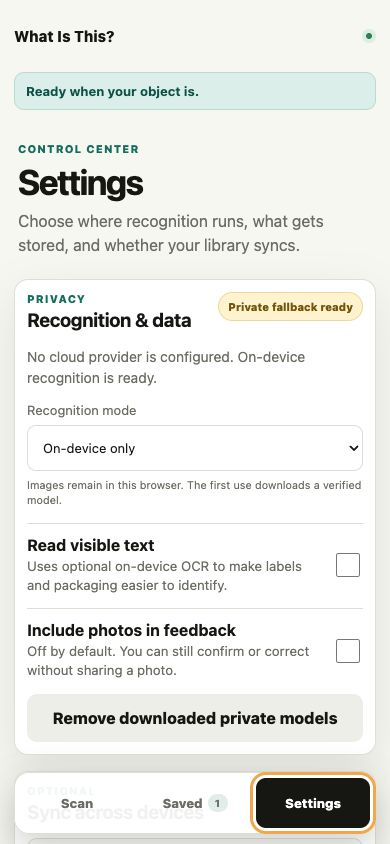

# Product, stability, and security improvements

All improvements use free browser APIs, open-source packages, or optional free-tier services. The application remains usable without an account, paid API, or cloud database by selecting **On this device** in Settings.

## 1. Focused scan experience

The original all-in-one page is now a single-purpose Scan view with a clear primary action, privacy status, camera/upload choice, and advanced controls tucked into a disclosure. This reduces first-screen overload and makes the main task obvious on a phone.

## 2. Clear result and consent flow

Results open in a dedicated view with plain-language confidence, explicit confirmation or correction, and a save action that stays locked until the identification is verified. This prevents uncertain predictions from entering the library and keeps the next decision easy to understand.

## 3. A useful saved library

Saved objects can now be searched, favorited, organized into boards, tagged, viewed, removed, or cleared. This turns the app from a one-off scanner into a reusable personal reference library.

## 4. Private, free on-device recognition

Settings now offers an on-device mode using MobileNetV2, browser barcode detection, and optional OCR, with integrity-checked model downloads and a cache-removal control. Images can stay entirely in the browser while recognition remains available after the model's first download.

## 5. Learning corrections and duplicate protection

Corrections now save model labels plus compact image fingerprints and visual signatures, so similar future scans can reuse what the person taught the app. Name and visual-similarity checks also stop accidental duplicate saves.

## 6. Durable storage and ownership

Saved boards, preferences, corrections, and accuracy feedback now use validated, versioned IndexedDB storage with legacy migration and safe fallbacks. People can export a complete backup, delete all local data, and optionally sync with a passwordless Supabase account.

## 7. Resilient offline-ready application shell

The PWA service worker caches only trusted static application assets, limits cache growth, and avoids API or arbitrary request caching. A route-level error boundary and cloud-to-device fallback keep the core scan journey recoverable when a service fails.

## 8. Hardened free deployment path

Uploads are type/size validated, remote inference is rate-limited and optionally Turnstile-protected, backend calls require a strong shared token, and the Python container runs as a non-root user. Security headers, dependency auditing, unit tests, responsive accessibility checks, and automated CI guard future changes without a paid service.

## Verification

- 16 web unit tests
- 7 Python service tests
- TypeScript type check
- Next.js production build
- Production dependency audit: 0 known vulnerabilities
- Interactive phone and desktop journey verification
