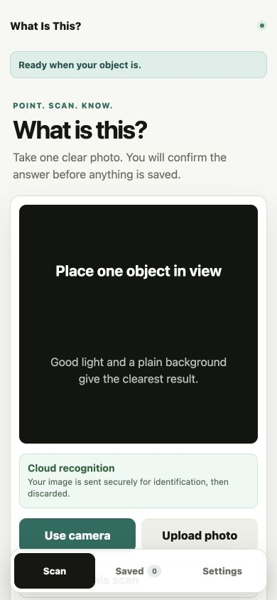
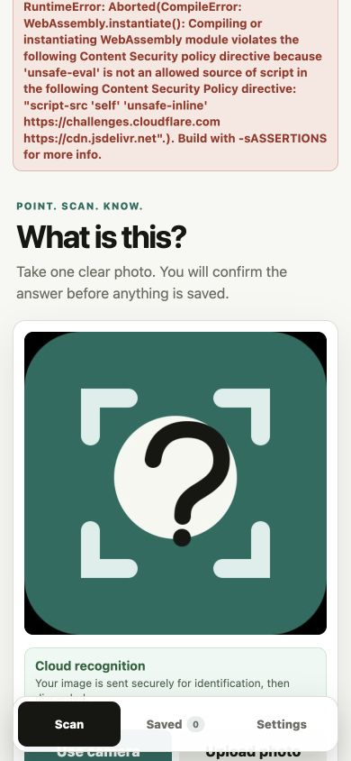
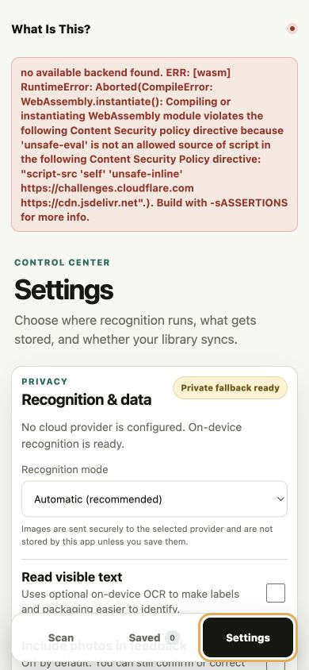
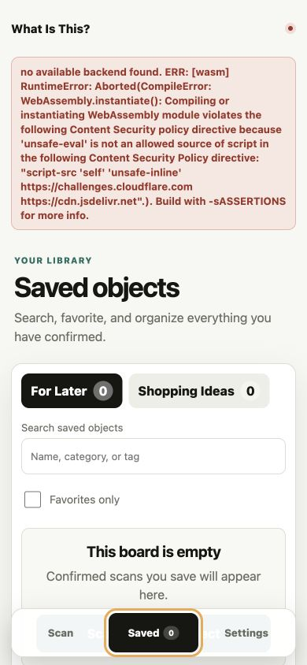

# Current product audit — 2026-08-05

## Scope

Combined UX and accessibility audit of the phone-first journey: start a scan, identify an object, recover through Settings, and inspect the empty Saved library. Viewport: 390 × 844 in the Codex in-app browser against the production build.

## Step 1 — Scan landing

**Health: Needs attention.** The hierarchy, privacy explanation, and camera/upload choices are clear, but the longer Cloud recognition message pushes the action row beneath the fixed bottom navigation at this viewport.

## Step 2 — Identification

**Health: Blocked.** With no cloud provider configured, Automatic mode correctly attempts the private fallback, but the production Content Security Policy blocks ONNX Runtime's WebAssembly compilation; the UI then exposes the complete internal runtime error instead of an actionable message.

## Step 3 — Settings and recovery

**Health: Needs attention.** Settings says on-device recognition is ready while the persistent global error proves it is not, and Automatic remains described as recommended even though no working provider exists.

## Step 4 — Saved library

**Health: Structurally healthy, journey blocked.** Boards, search, favorites, and the empty-state call to action are understandable, but the raw error remains globally visible and dominates this unrelated view.

## Strengths

- Clear Scan, Saved, and Settings information architecture.
- Strong visible hierarchy and large interaction targets.
- Explicit privacy copy and feedback-photo consent.
- Helpful empty-library state.
- Semantic headings, regions, tabs, labels, and live status are present in the observed DOM.

## Prioritized improvements

### P0 — Restore the core identification journey

1. Permit WebAssembly compilation with the narrow CSP directive supported by ONNX Runtime (`'wasm-unsafe-eval'`) or change the runtime build so it does not require dynamic WASM compilation; do not add broad production `'unsafe-eval'` without a separate security review.
2. Self-host the ONNX Runtime WASM files with the application so CSP, offline behavior, and version pinning have one origin and one deployment lifecycle.
3. Add a production test that uploads an image with no cloud backend configured and asserts that the on-device result renders.

### P0 — Replace internal errors with recovery

1. Convert provider/runtime failures into a short message such as “Private recognition could not start” with Retry and Open Settings actions.
2. Keep the technical exception in development logs or downloadable diagnostics, not in the global live region.
3. Clear or scope errors when the person moves to Saved or Settings so unrelated views are not dominated by stale failures.

### P1 — Make provider state truthful

1. Default to On-device only when no remote provider is configured, or rename Automatic to explain exactly what is currently available.
2. Add model download size/progress, cancel/retry, and a clear “Ready offline” state.
3. Disable choices that cannot currently work and explain how to make them available.

### P1 — Prevent mobile navigation overlap

1. Reserve enough bottom space for the fixed navigation across all privacy-copy lengths and safe-area sizes.
2. Add visual regression coverage at 320 × 568, 375 × 812, 390 × 844, 200% zoom, and landscape orientation.

### P1 — Protect synchronized data

1. Merge local and cloud boards by stable IDs instead of replacing the local library whenever non-empty cloud data loads.
2. Add backup import/restore to complement Export, including schema validation and a preview before applying changes.
3. Surface sync conflicts, last successful sync, and offline pending changes.

### P2 — Improve correction quality

1. Let people inspect, edit, or remove learned corrections and prevent one mistaken correction from affecting future matches indefinitely.
2. Explain when a learned correction influenced a result and allow “Ignore this learning” from the result screen.
3. Benchmark false matches from the compact visual signature before expanding correction reuse.

### P2 — Complete accessibility verification

1. Move focus to each new view heading and to the first recovery action after a failure.
2. Announce a concise error once rather than an implementation stack trace in a persistent polite live region.
3. Verify keyboard order, VoiceOver behavior, measured contrast, reflow at 200–400% zoom, camera permission recovery, and reduced-motion behavior on real devices.

### P2 — Separate developer previews

1. Resolve the development-port collision. **Resolved:** this app now owns `127.0.0.1:3000` and startup reports any future listener conflict.
2. Add a startup check that reports the exact owning process when the requested port is already occupied.

## Evidence limits

The identification flow could not proceed beyond the production WASM/CSP failure, so confirmation, correction, saving, and shopping-detail interactions were not re-audited in this run. Screenshots and DOM structure can reveal likely accessibility risks, but they do not establish WCAG compliance without keyboard, assistive-technology, zoom, contrast, and real-device testing.
